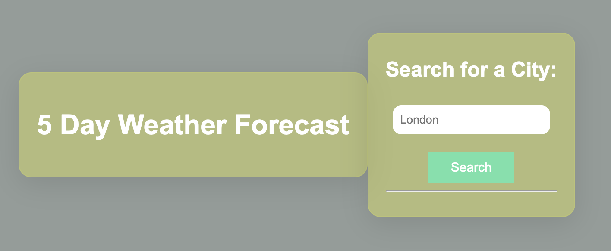

# 5 Day Weather Forecast Dashboard by Server API
Using the [Weather Forecast](https://openweathermap.org/forecast5) to retrieve weather data for cities, I have build a 5 Day Weather Forecast Dashboard. This Weather dashboard will run in the browser and feature dynamically updated HTML and CSS. It'll use localStorage to store any persistent data. 

https://setsu-adachi.github.io/5day-weather-forecast-dashboard/

## Installation
Clone the repo
git clone 
https://github.com/Setsu-Adachi/5day-weather-forecast-dashboard

## Configuration
https://setsu-adachi.github.io/5day-weather-forecast-dashboard/

## Acknowledgement
I have referred to a coding boot camp and Devression tutorial on how to work with the OpenWeather API. 
[Full-Stack Blog on how to use API keys](https://coding-boot-camp.github.io/full-stack/apis/how-to-use-api-keys),
[Build a Simple Weather App](https://www.youtube.com/playlist?list=PL7xMD2CrkhbLNspprTyKVtM94rMjzQBuo).

  ## License
Distributed under the MIT License, See LICENSE.txt for more info

## Contributing
If you have any suggestions or improvements, feel free to open an issue or create a pull request. Contributions are welcome!

Enjoy creating Code Quiz by Web API. If you have any questions or need help, don't hesitate to reach out. Happy coding!
